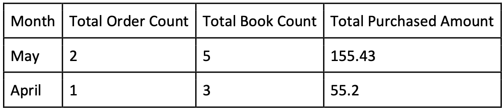

ReadingIsGood is an online books retail firm which operates only on the Internet. Main target of ReadingIsGood is to deliver books from its one **centralized** warehouse to their customers within the same day. That is why stock **consistency** is the first priority for their vision operations.

**In this case, we will only consider;**

- Registering New Customer
- Placing a new order
- Tracking the stock of books
- List all orders of the customer
- Viewing the order details
- Query Monthly Statistics

**Base Requirements:**
- Java (min SDK 11), Spring Framework (Spring Boot is more than welcome)
- Relational (H2 could also be an option) / Non-Relational Database (you can use your
favorite)
- Restful Endpoints
- Clean Code
- Test ( Unit & Integration - min %50 functionality coverage )
- Documentation (Brief definition about your design. Tech Stack that you used. How
to start the project. if needed, credentials should be included. If there is any
assumption, they should be highlighted etc.)
- Containerize - Please containerize your application

**Must Have Requirements:**
- Customer Controller
  - Will persist new customers
  - Will query all orders of the customer ( Paging sounds really nice )
- Book Controller
  - Will persist new book
  - Will update book’s stock
- Order Controller
  - Will persist new order (statuses may used) 
    - Will update stock records.
    (Hint: what if it happens if 2 or more users tries to buy one last book
    at the same time)
  - Will query order by Id
  - List orders by date interval ( startDate - endDate )
- Statistics Controller
  - Will serve customer’s monthly order statistics
    - Total Order count
    - Total amount of all purchased orders
    - Total count of purchased books
    That endpoint will supply data for the following ui component

- **Validations** - Please be sure your system is error proof.
  - For eg.
  - We are sure that some users would like to buy -1 items
  - They would like to register via the same email again and again
  - if you need any extra, please feel free to add
- **Authentication** - Please secure endpoints (for ex. bearer token)
- **Responses** - Please define success and error response models and use them 
- **Postman** - Please prepare Postman request and share with us

**Nice to Have’s:**

- **Logging** - Log all changes on entities. (Which user made specific changes and when)
- **Open API Specification** ( Swagger sounds nice ) (authentication not needed)

**How to Submit:**

- You could use your Github, Bitbucket etc account and share link with us (Git usage is a **bonus**)
- You could share it over cloud file sharing platform ( we prefer Google Drive )
  - If you want to restrict the access, please express that in the response mail
  that we could request access over our getir.com mail addresses.
- If you prefer, we could create a private repository in Getir Github Account than grant
your access ( to achieve this, we need your github account )